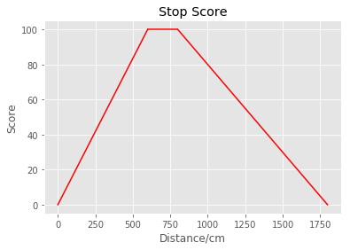
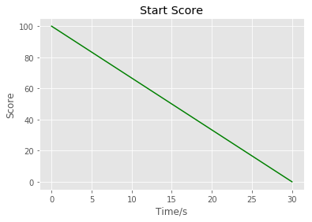

# 评判标准
首期无人驾驶培训最终测评主要分为两个方面：
- 实地测试 (80%)
- 团队协作 (20%)
 
## 实地测评 (80%)
在实地测评中，选手们主要进行红绿灯检测控制车辆的测评。红绿灯检测控制车辆主要分为两个阶段：
1. 在行驶过程中，摄像头检测到红灯可以停在指定的区域内。

    汽车在自动驾驶模式下，工作人员将测量交通灯与汽车的垂直距离。若汽车能够在指定距离的范围内停车，那么得分将最高。当在指定距离外停下，则会依次减分。满分 100，最低分 0 分。(汽车距离交通灯垂直距离 6-8m 为满分) 需要注意的是，最终距离是按照前排轮子靠前的轮子的中线与交通灯水平线的垂直距离进行测量。测量精度为 cm。所得到的分数为占最终总得分权重的 40%。其得分图示如下：
    
    
    
2. 在停止的状态下，摄像头检测到绿灯是否可以有效启动。
    
    汽车在自动驾驶模式停止的状态下，摄像头检测到绿灯，那么启动时间越快，则得分越高。满分 100，最低分 0 分。测量精度为 s，以四舍五入方式记录。所得到的分数为占最终总得分权重的 40%。其得分图示如下：
    
    

以上两个阶段中，汽车若撞到交通灯积分将清零。

计分方式为工作人员手动测量。并由 PIX 驾驶人员坐在驾驶位，车内无任何其他组员。可能有误差，尽请谅解。

红灯测评中在第一轮先经过绿灯测试，以防止使用路点定位强制停止。

选手赛前由队长进行竞赛顺序抽签。所以，对于天气等不可控因素，将不考虑在最终测评标准范围内。

为了排除偶然因素，我们决定每组测评每个战队测验 5 次，去掉最差成绩，剩余 4 次成绩取平均值。
## 团队协作 (20%)
1. 在团队协作方面，我们会根据学员在培训 5 天的表现进行综合评分。我们将根据个体学员与团队融合度，团队的氛围，以及竞赛其他方面如团队工作环境的卫生情况进行测评。其团队协作得分占据最终得分权重的 10%。

2. 团队总结分享，在活动的结尾，各个团队准备 15-20 分钟的 演讲分享。分享的成绩将占总成绩占据最终得分权重的 10%。
