# PIX & Udacity & Tier IV 无人驾驶真车实训
所有代码见我的百度云盘链接，可以按照Autoware操作步骤进行可视化显示。

## Result Dispaly

完整视频：<https://www.youtube.com/watch?v=wGQy6vhSQLg>

<div align=center></div>

## Overview

* 无人驾驶开源软件 Autoware的学习；
* 实测场地红绿灯数据采集，为数据打标签，训练红绿灯检测模型；
* PCD地图创建：Velodyne-16 Lidar实测场地录制点云数据，通过Ndt_Mapping创建PCD地图；
* 定位：通过PCD地图和Lidar传感器数据实现车辆的定位；
* 路径跟随：创建实测场地的路点.csv文件，实现真车无人驾驶路点跟随；
* 控制策略：结合红绿灯检测模型实现红绿灯启停控制策略。

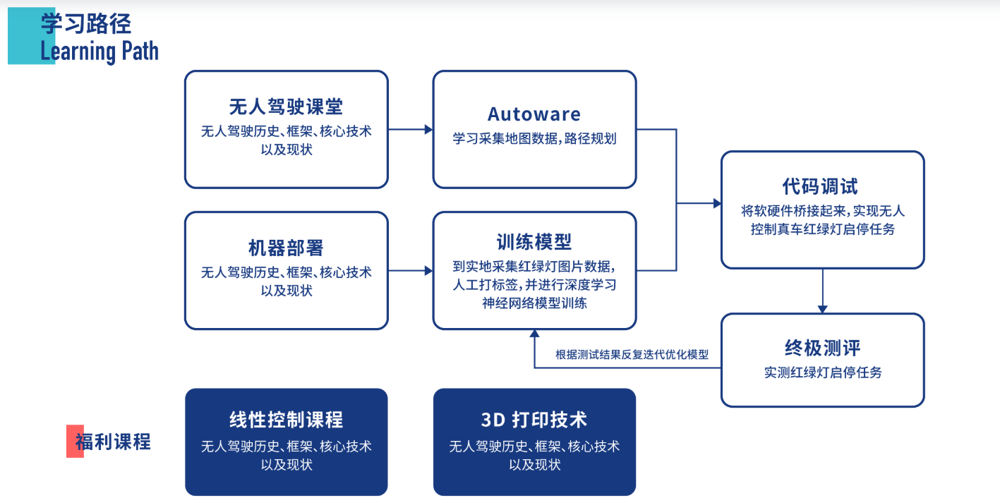

##  Autoware

- [Autoware 安装](https://github.com/lilyhappily/PIX-Udacity-Tier-IV-Self-Driving-Car-BootCamp/blob/master/PIX-Self-Driving-Engineering-Base-master/autoware_install.md)

- Autoware框架

  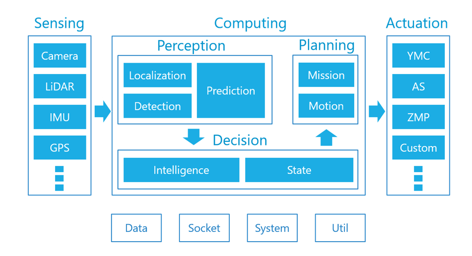

- Auto ware学习内容：

  [**Chapter 1： Basic Operations of Autoware**](https://github.com/lilyhappily/PIX-Udacity-Tier-IV-Self-Driving-Car-BootCamp/blob/master/PIX-Self-Driving-Engineering-Base-master/handouts-DAY2.pdf)

  <div align=center></div>

  
  [**Chapter 2：Data Recording/Playing and Sensor Calibration** ](https://github.com/lilyhappily/PIX-Udacity-Tier-IV-Self-Driving-Car-BootCamp/blob/master/PIX-Self-Driving-Engineering-Base-master/handouts-DAY2.pdf)

  <div align=center>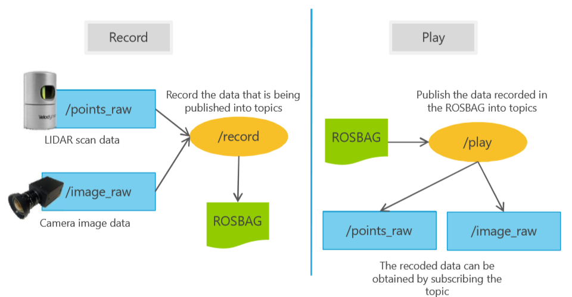</div>

  
  [**Chapter 3：3D Map Generation and Localization**](https://github.com/lilyhappily/PIX-Udacity-Tier-IV-Self-Driving-Car-BootCamp/blob/master/PIX-Self-Driving-Engineering-Base-master/handouts-DAY2.pdf)

  <table style="width:100%">
    <tr>
      <th>
        <p align="center">
         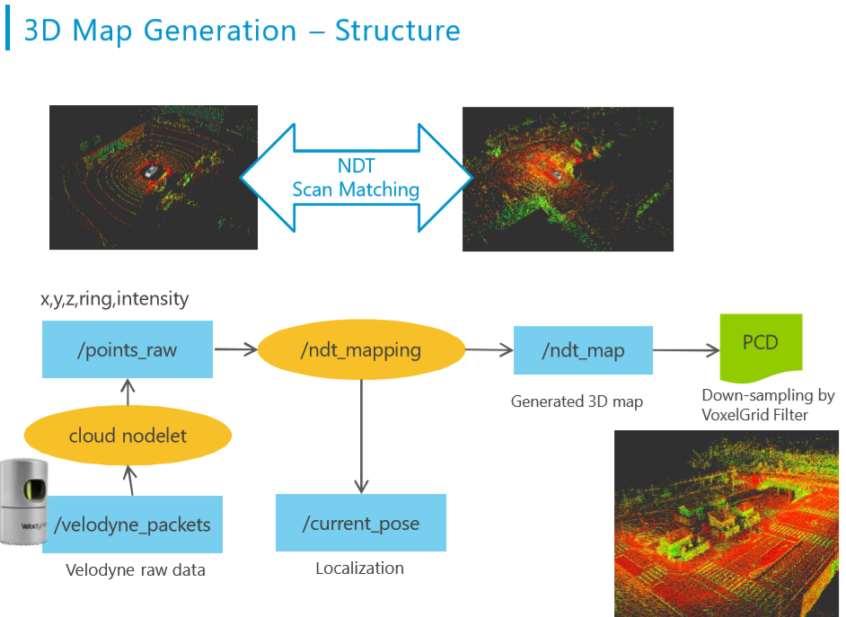
        </p>
      </th>
      <th>
        <p align="center">
         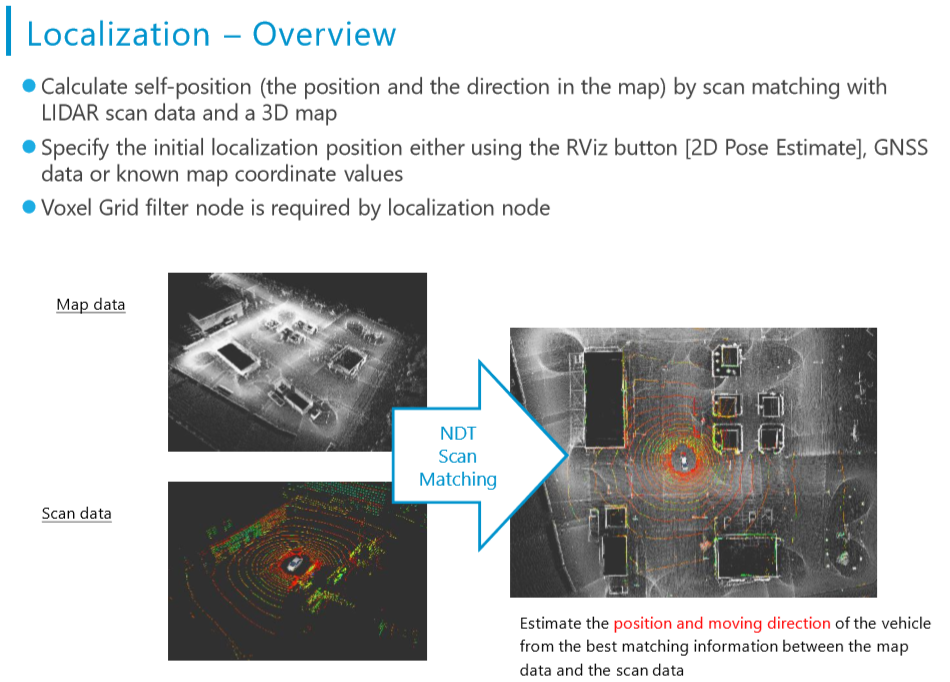
        </p>
      </th>
    </tr>
    </table>

  

  [**Chapter 4：Object Detection and Tracking**](https://github.com/lilyhappily/PIX-Udacity-Tier-IV-Self-Driving-Car-BootCamp/blob/master/PIX-Self-Driving-Engineering-Base-master/handouts--DAY3.pdf)

  <table style="width:100%">
    <tr>
      <th>
        <p align="center">
         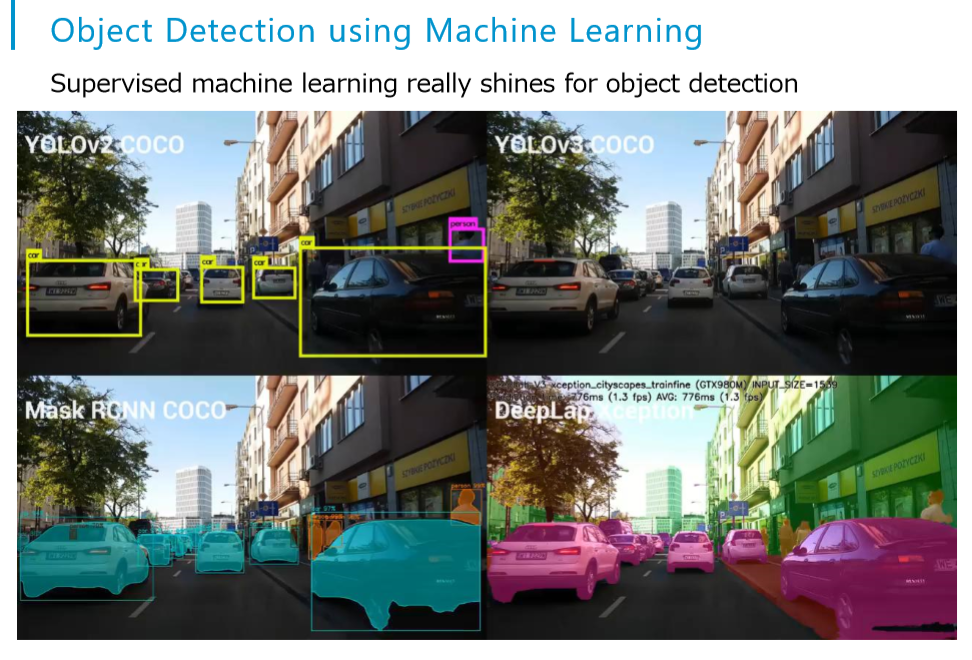
        </p>
      </th>
      <th>
        <p align="center">
         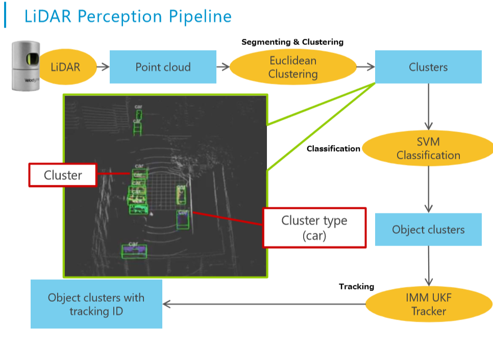
        </p>
      </th>
    </tr>
    </table>

  

  [**Chapter 5：Path Generation and Path Planning**](https://github.com/lilyhappily/PIX-Udacity-Tier-IV-Self-Driving-Car-BootCamp/blob/master/PIX-Self-Driving-Engineering-Base-master/handouts--DAY3.pdf)

<div align=center>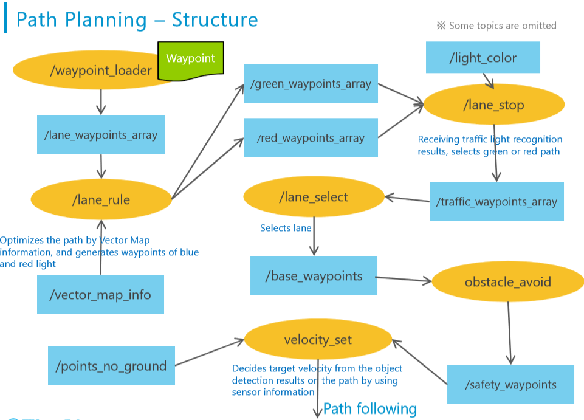</div>

  

  [**Chapter 6：Path Following and Vehicle Control**](https://github.com/lilyhappily/PIX-Udacity-Tier-IV-Self-Driving-Car-BootCamp/blob/master/PIX-Self-Driving-Engineering-Base-master/handouts--DAY3.pdf)

  <div align=center>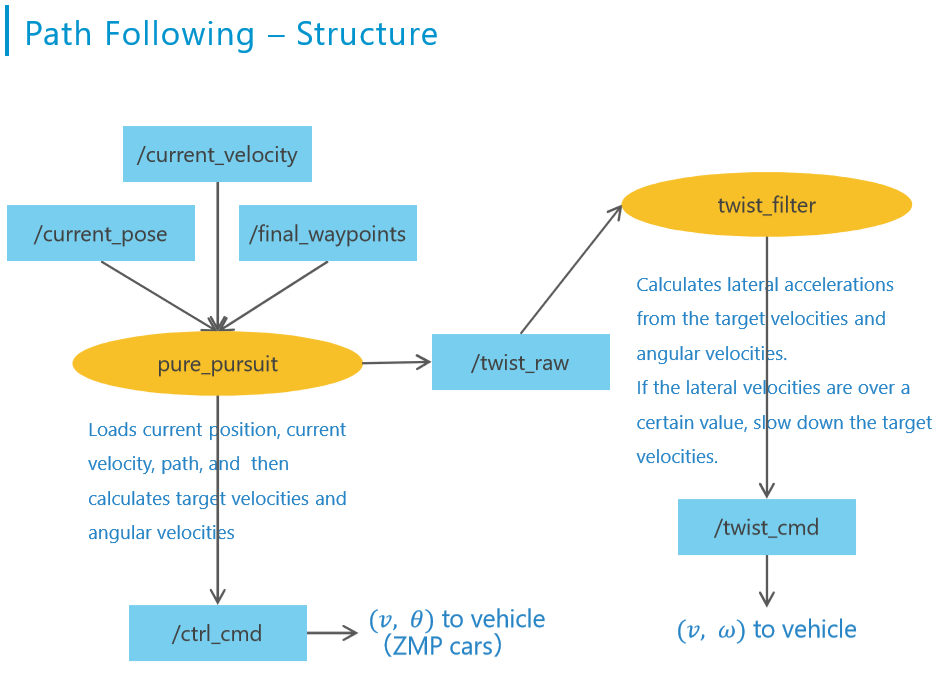</div>

  

## Traffic Lights Model

- 采集实测场地红绿灯数据，对数据进行打标签，[在Tensorflow API的基础上采用`ssd_inception_v2_coco`进行模型的训练](https://github.com/lilyhappily/PIX-Udacity-Tier-IV-Self-Driving-Car-BootCamp/blob/master/PIX-Self-Driving-Engineering-Base-master/tensorflow_api.md)。模型训练后进行实际场地的测试时发现，模型很不稳定，分析原因发现，在不同的时间段绿灯的颜色显示不一样，有黄色、白色、绿色等，数据的多样性非常重要，所以在模型的训练过程中加入数据增强的方法，使模型的泛化能力更强。下图显示了不同时刻，光照不同的情况下绿灯的状态：

<table style="width:100%">
  <tr>
    <th>
      <p align="center">
       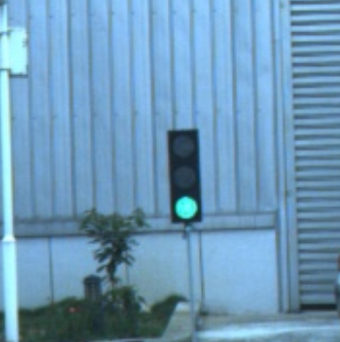
      </p>
    </th>
    <th>
      <p align="center">
       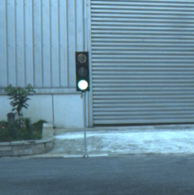
      </p>
    </th>
    <th>
      <p align="center">
       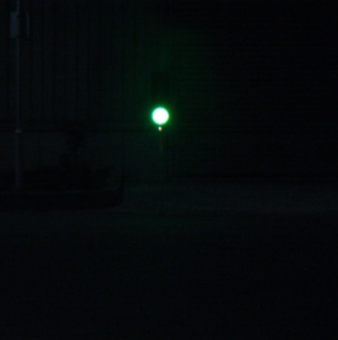
      </p>
    </th>
  </tr>
  </table>

- TensoFlow API提供了很多数据增强的方法以提高模型的稳定性，在[Preprocessor.proto](https://github.com/tensorflow/models/blob/master/research/object_detection/protos/preprocessor.proto)里列举了很多可以使用的数据增强方法，可以根据自己训练模型的实际情况选择合适的数据增强方法。

```python
NormalizeImage normalize_image = 1;
RandomHorizontalFlip random_horizontal_flip = 2;      
RandomVerticalFlip random_vertical_flip = 3
RandomPixelValueScale random_pixel_value_scale = 4;
RandomImageScale random_image_scale = 5;
RandomRGBtoGray random_rgb_to_gray = 6;
RandomAdjustBrightness random_adjust_brightness = 7;
RandomAdjustContrast random_adjust_contrast = 8;
RandomAdjustHue random_adjust_hue = 9;
RandomAdjustSaturation random_adjust_saturation = 10;
RandomDistortColor random_distort_color = 11;
RandomJitterBoxes random_jitter_boxes = 12;
RandomCropImage random_crop_image = 13;
RandomPadImage random_pad_image = 14;
RandomCropPadImage random_crop_pad_image = 15;
RandomCropToAspectRatio random_crop_to_aspect_ratio = 16;
RandomBlackPatches random_black_patches = 17;
RandomResizeMethod random_resize_method = 18;
ScaleBoxesToPixelCoordinates scale_boxes_to_pixel_coordinates = 19;
ResizeImage resize_image = 20;
SubtractChannelMean subtract_channel_mean = 21;
SSDRandomCrop ssd_random_crop = 22;
SSDRandomCropPad ssd_random_crop_pad = 23;
SSDRandomCropFixedAspectRatio ssd_random_crop_fixed_aspect_ratio = 24;
```

- 在训练红绿灯检测过程中发现，光线对红绿灯的影响很大，不同时间段采集的红绿灯颜色差别很大，所以在本项目的实际训练过程中采用调节亮度和对比度的数据增强方式，在模型的.config文件中修改关于数据增强的方法如下：

```python
data_augmentation_options {
    random_adjust_brightness {
        max_delta=0.2
    }
  }

data_augmentation_options {
    random_adjust_contrast {
        min_delta=0.8,
        max_delta=1.25    
    }
  }
```

- 在数据增强中可以选择自己合适的参数，此参数会覆盖在[`preprocessor.py`](https://github.com/tensorflow/models/blob/master/research/object_detection/core/preprocessor.py)源代码中有相应的数据增强的具体参数：

```python
def random_adjust_brightness(image,
                             max_delta=0.2,
                             seed=None,
                             preprocess_vars_cache=None):
                             
def random_adjust_contrast(image,
                           min_delta=0.8,
                           max_delta=1.25,
                           seed=None,
                           preprocess_vars_cache=None):
```

- 模型训练大概35000steps，模型的最终total_loss曲线如下：

  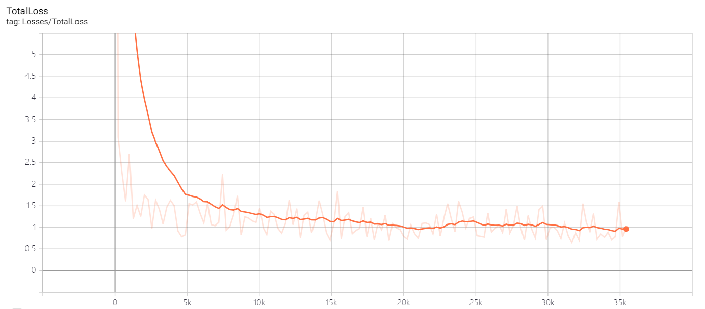

  

  在最终的实际场地测试中，模型可以很准确的识别红灯，由于绿灯的数据多样性原因，绿灯识别不是特别灵敏，但是可以完全满足红绿灯时刻的启停问题；

## [Map Generation and Localization](https://github.com/lilyhappily/PIX-Udacity-Tier-IV-Self-Driving-Car-BootCamp/blob/master/PIX-Self-Driving-Engineering-Base-master/Autoware_manual_chinese_pix.pdf)

启动Velodyne-16激光雷达，采集实测场地BAG点云数据，生成PCD地图， 加载激光雷达传感器和PCD实测场地地图，进行真车的定位：

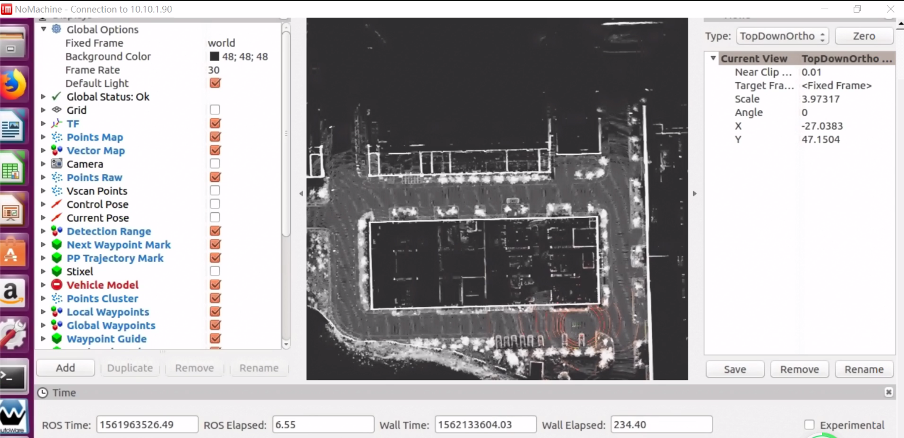

## [Path Following](https://github.com/lilyhappily/PIX-Udacity-Tier-IV-Self-Driving-Car-BootCamp/blob/master/PIX-Self-Driving-Engineering-Base-master/Autoware_manual_chinese_pix.pdf)

成功定位后，加载路径，实现路径跟随：

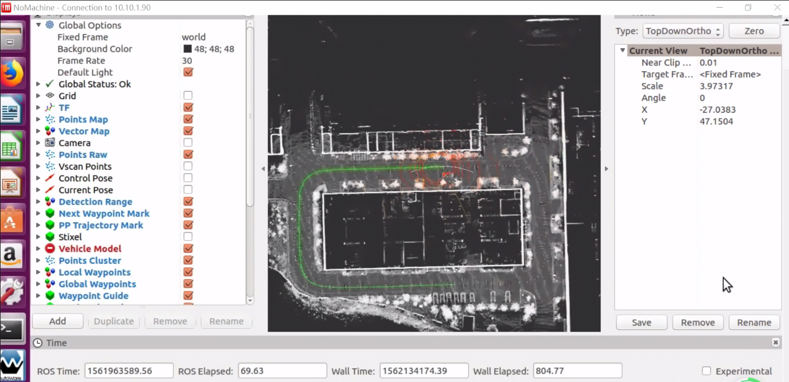

## [Vehicle Control](https://github.com/lilyhappily/PIX-Udacity-Tier-IV-Self-Driving-Car-BootCamp/blob/master/PIX-Self-Driving-Engineering-Base-master/Autoware_manual_chinese_pix.pdf)

修改tl_detenctor.py节点，结合训练好的红绿灯模型，实现车辆的红绿灯启停功能。在实际测试过程中发现，红绿灯模型可以非常稳定的识别红灯，由于绿灯数据的多样性，识别不是特别稳定，但是不会出现把绿灯识别为红灯的严重错误行为，所以能够比较正确的实现真车红绿灯的启停。

<table style="width:100%">
  <tr>
    <th>
      <p align="center">
       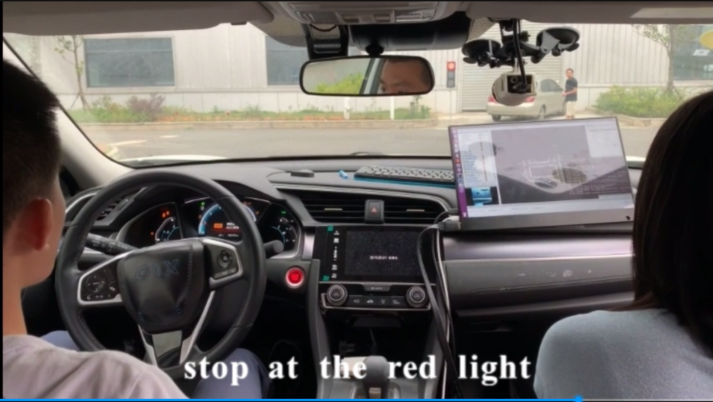
      </p>
    </th>
    <th>
      <p align="center">
       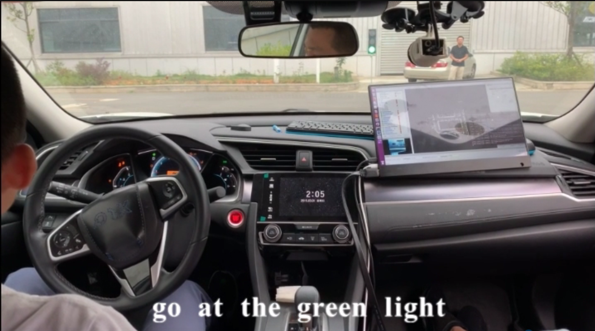
      </p>
    </th>
  </tr>
  </table>

